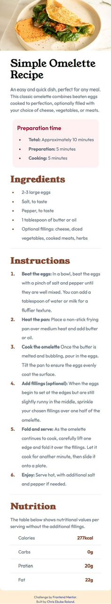

# Frontend Mentor - Recipe page solution

## Table of contents

- [Overview](#overview)
  - [The challenge](#the-challenge)
  - [Screenshot](#screenshot)
  - [Links](#links)
- [My process](#my-process)
  - [Built with](#built-with)
- [Author](#author)

**Note: Delete this note and update the table of contents based on what sections you keep.**

## Overview
This is a solution to the [Recipe page challenge on Frontend Mentor](https://www.frontendmentor.io/challenges/recipe-page-KiTsR8QQKm). Frontend Mentor challenges help you improve your coding skills by building realistic projects. 

### Screenshot

 

### Links

- Solution URL: [Solution](https://your-solution-url.com)
- Live Site URL: [live site](https://your-live-site-url.com)

## My process

### Built with

- Semantic HTML5 markup
- CSS custom properties
- Flexbox
- Mobile-first workflow
- [React](https://tailwindcss.com/) - Tailwind CSS

## Author

- Author - Chris Ebube Roland
- Frontend Mentor - [@ChrisRoland](https://www.frontendmentor.io/profile/ChrisRoland)
- Twitter - [@chrisebuberolnd](https://www.twitter.com/chrisebuberolnd)
